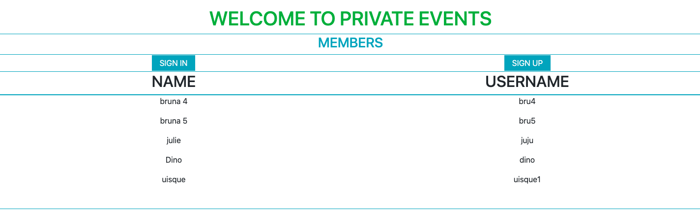

# private-events

In this project, you will build an application named Private Events and that behaves similar to Eventbrite. The main goal is to put in practice the main concepts of Associations in rails, where a user can create events and also attend many events. An event can be attended by many users.



# Built With

- Ruby
- Rails
- VSCode

# Requirements

- Ruby > 2.6.5
- Rails > 5.2.4.3

## Getting Started

You can get a local copy of the repository please run the following commands on your terminal:

```
$ cd <directory>
```

```
$ git clone git@github.com:brugobi/private-events.git
```

# App Information

The App has the next pages:

- welcome: to display all members.

- SIGN IN/SIGN OUT: To sign in or create a new member.

- New Event: To create a new event


# Playing with the application 

- If you run the follow command on your terminal, you will be able to run the code on your web browser

```
$ bundle install
```
```
$ rails db:migrate
```
```
$ rails server
```

- Create a new user and new event.
- You also can attend someone else event

## Live Demo

[Live Demo Link](https://members-only-bruna-emi.herokuapp.com)


## Authors

👤 **Emilio Contreras**

- Github: [@emiliocm9](https://github.com/emiliocm9)
- Twitter: [@emiliocm31](https://twitter.com/emiliocm31)
- Email: [email](emilio.contreras97@gmail.com)

👤 **Bruna Gobi**

- Github: [@brugobi](https://github.com/brugobi)
- Twitter: [@BrunaGobi2](https://twitter.com/BrunaGobi2)
- Linkedin: [bruna-gobi](https://www.linkedin.com/in/bruna-gobi/)

## 🤝 Contributing

Contributions, issues and feature requests are welcome!

## Show your support

Give a ⭐️ if you like this project!

## Acknowledgments

- Hat tip to anyone whose code was used
- Inspiration
- Microverse

## 📝 License

This project is [MIT](lic.url) licensed.